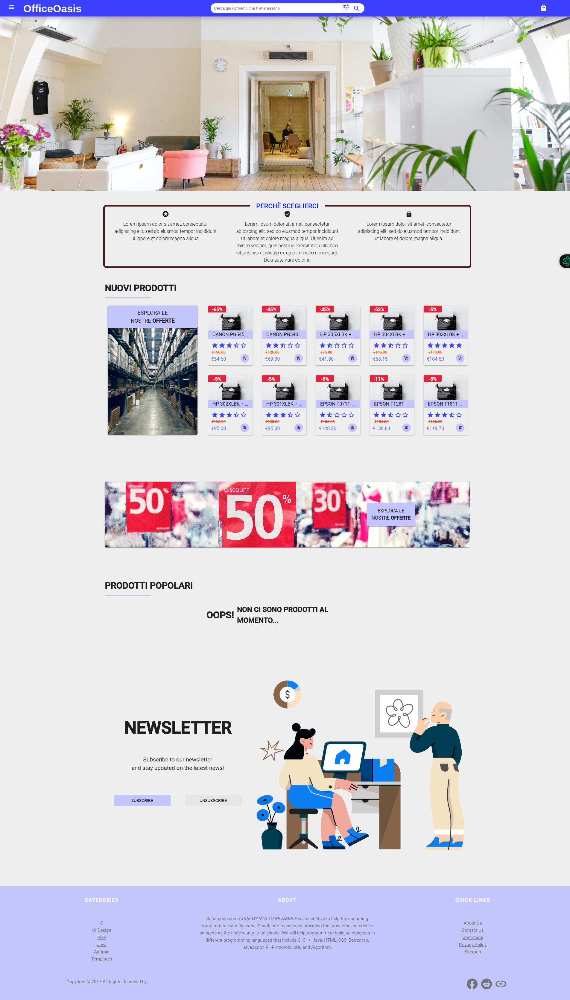
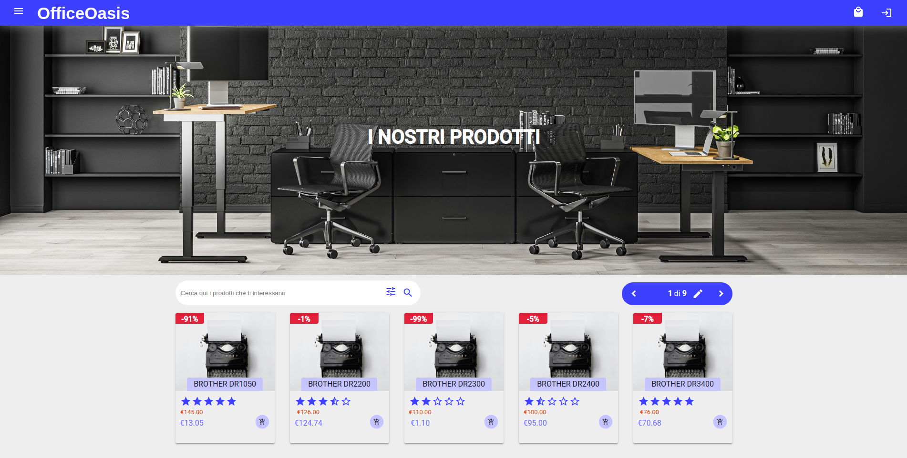
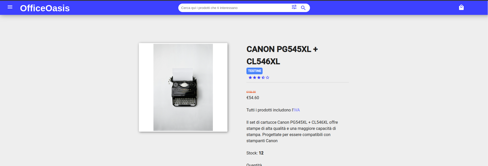
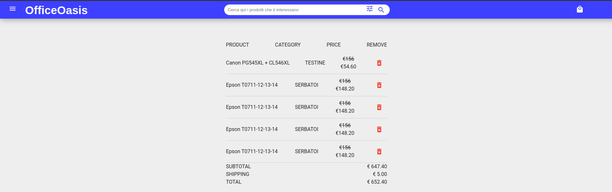
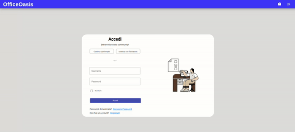
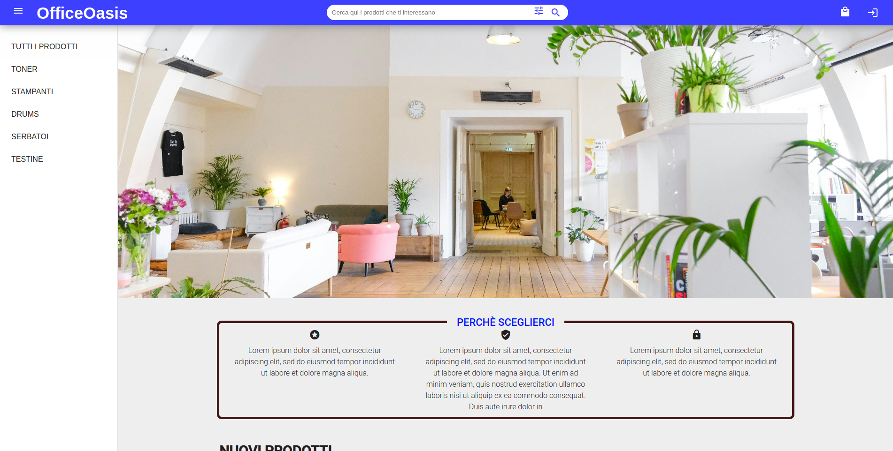

# OfficeOasis Overview

OfficeOasis is an innovative web application designed for efficient office management. This overview highlights some of the key features of the application, showcasing its user-friendly interface and functionalities.

## 🌟 Key Features

### 1. Home Dashboard

The home dashboard provides a quick overview of essential information, allowing users to navigate effortlessly through various sections.

### 2. Product Page

Explore the comprehensive product page where users can find detailed information about each product, including specifications and pricing.

### 3. Product Details

The product details section offers an in-depth look at individual items, enhancing user experience with clear images and descriptions.

### 4. Shopping Cart

Manage your selections seamlessly with the shopping cart feature, allowing users to review items before checkout.

### 5. Fast Overview of Logs

Stay updated with the log overview that provides quick insights into system activity and user interactions.

### 6. Home Side Dashboard

The home side dashboard complements the main dashboard by offering additional navigation options and insights.

## 🎥 Demo

Check out the demo to see how OfficeOasis works in action! 

> **Note:** All images and GIFs above are representative of the application's interface and functionalities. 

Feel free to reach out for any questions or feedback!
